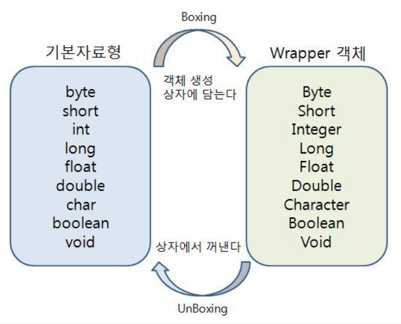

#JAVA

>객체지향프로그래밍(OOP) 언어로 OS에 독립적이다.

##객체
클래스를 힙 영역에 적제해서 올린 실제 구현체 _instance_

##클래스
  - 멤버
    - 필드 : 속성 
      - 클래스 변수 (static)
      - 인스턴스 변수 (non-static)
    - 메소드 : 기능 (명령문들의 집합)
  - 생성자 : 멤버 변수 초기화, 객체 생성

##접근제한자
접근 참조 할 수 있는 범위를 제한 
  - public : 어디서나 접근 허용
  - protected : 같은 패키지에 있는 객체와 상속관계의 객체들만 허용
  - default : 같은 패키지에 있는 객체만 허용
  - private : 현재 객체 내에서만 허용
 
##OOP특징
  - 추상화 : 공통되는 하나의 추상적인 큰 개념으로 묶는것
  - 캡슐화 : 코드를 은닉화
  - 상속 : 상위 객체의 모든 것을 하위 객체가 물려 받는것
  - 다형성 : 하나의 이름으로 여러 기능을 할 수 있는것
    - ex)Overloading : 파라미터의 개수나 타입이 달라야하며 리턴타입은 상관없다.
    - cf)Overridng(재정의) : 부모의 메서드와 똑같이 만들어야 재정의가 된다.

#Type 
값의 모양
##기본타입 call by value
호출시 값이 리턴된다.
  - 정수형
    - byte | 1바이트 정수 | _-128 ~ 127_
    - short | 2바이트 정수 | _-32768 ~ 32768_ 
    - int | 4바이트 정수 | _-21474883648 ~ 2147483647_
    - long | 8바이트 정수 | _-2^63 ~ 2^62-1_
  - 실수형 
    - float | 4바이트 실수
    - double | 8바이트 실수
  - 문자형
    -char | 2바이트 유니코드 _'\u0000 ~ \uffff'_
  - 논리형
    -boolean | 참/거짓 
  - 문자열 
    - String | 
    
```
기본타입은 값 자체를 가지고 있기 때문에 기능을 할 수 없다.
Wrapper class로 만들어 기능을 할 수 있게 한다.
```
 ##참조타입 call by reference
 오브젝트(java.lang.object)를 상속받는 모든 클래스
 호출시 주소값이 리턴된다.
 
 ##Array
 같은 타입의 값을 효과적으로 관리해주는 객체
 처음 만들때 크기가 고정된다.
   - shallow copy : 해당 객체의 주소값만 복사해오기 때문에 복사한 객체를 바꾸면 원본도 바뀐다.
   - deep copy : 객체 자체가 복사된다.
 
 ##collection
 값을 효과적으로 관리해주는 객체.
 CollectionframeWork 자료구조를 담당하는 프레임 워크. 
 추가,삭제,정렬등의 처리가 가능하여 자료구조적 알고리즘을 구현 할 필요가 없다.
 * 공간의 제약이 없다. 자동으로 자리를 할당한다.
 * 추가,삭제,정렬이 쉽다. (자료구조내장)
 * 형태의 제약이 없다.(기본자료형 저장시 AutoBoxing)
 배열의 문제 (고정길이 , 추가삭제, 타입제한) -> 컬렉션 사용 
 *generic을 사용하여 type을 강제할 수 있다.
 
 ######Generics : 클래스나 메서드 내부에서 다룰 데이터의 Class Type 지정.

      |순서|중복| 
-----------------------------------------------------------------
 List | o | o | ArrayList , Vector, LinkedList
 set  | x | x  | HashSet , TreeSet
 map  | o | Key:x Val:o| HashMap, HashTable, TreeMap, Properties

 * ArrayList : 동기화를 지원하지 않는다. 보통 단일 스레드로 작업하기 때문에 더 효과적이다.
               초기용량 : 10
 * Vector : 동기화를 지원한다.
 * LinkedList : 인접 참조를 링크해 체인처럼 관리한다. 추가,삭제시 앞 뒤 링크만 변경하면 된다.

 * HashSet : 객체 저장시 hash 함수를 사용해 속도가 빠르다.
 * LinkedHashSet : HashSet과 유사하고 순서를 유지한다.
 * TreeSet : 이진 트리 기반 SetCollection , 정렬기준이 있어야 한다.
 
 ##추상클래스
 *추상메소드를 하나이상 가진 클래스 
 ######추상메소드 : 바디가 없다.
 
 ##인터페이스 
 모든 메서드가 추상메서드, 변수가 상수화 된다.
 
 ##Exception
   - run time exception : 실행시 발생하는 오류
   - checked exception : 컴파일시 발생하는 오류로 자바에서 미리 알려준다
 
 ##I/O
  - stream : 연속적인 데이터의 흐름
  - thread : 프로세스 내부에서 실행되고 있는 작업 단위 (하나의 모듈)
  - process : 실행되고 있는 단위
  - program : 실행할 수 있는 파일 
 