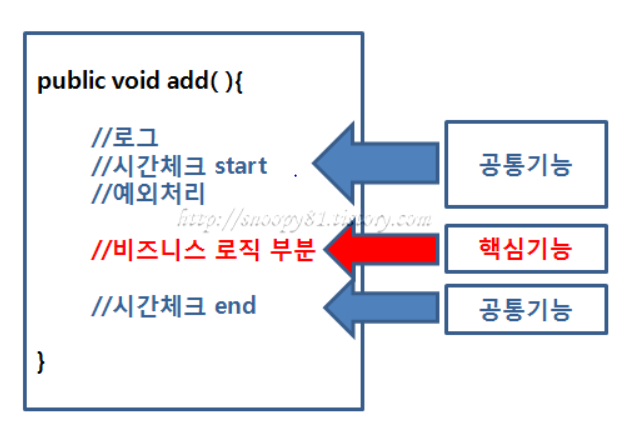
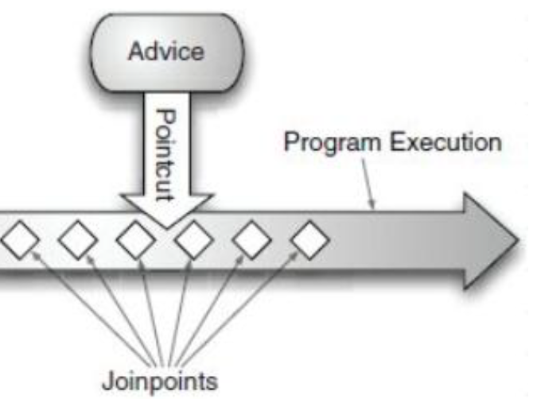
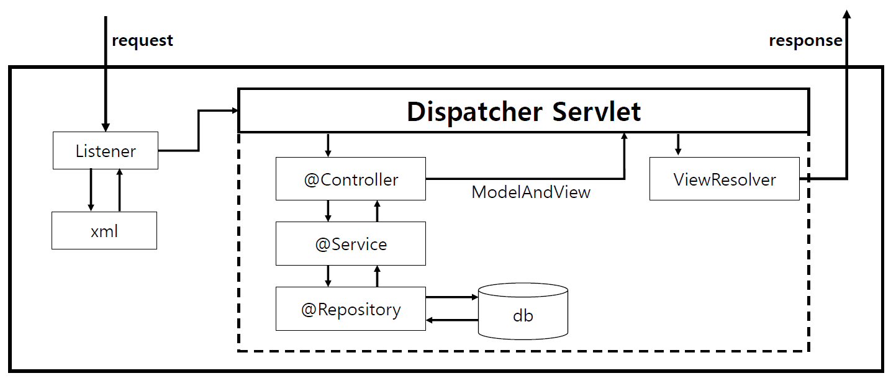

# Spring Framework
> pojo 기반 개발을 편하게하는 프레임워크이다.

###### Framework : 프로그램의 기본 골격으로 필요한 부분들을 만들어둔것 ex) Spring, Mybatis
       cf) Library (= module) : 기능들을 모아서 배포해둔것. ex) jQuery , ojdb6.jar
           Solution : 문제 해결을 위한 하드웨어 , 소프트웨어 ,기술적 방법 
###### Container : 객체를 담고있는것

 1) POJO : 순수 자바기술로만 이루어진객체 (DTO 생성자 , getter setter …) (plain old jaca object)
 2) 지금은 node.js , Django 등 spring 보다 가벼운게 많아졌다. 
 3) 특징
   ## 1.OCP 
   -OPEN CLOSED PRINCIPLE-
   > 클래스나묘듈은 확장에는 열려있어야하고 변경에는 닫혀있어야한다.
   
   ## 2.DI/IOC 
   - DEPENDENCY INJECTION  /  INVERSION OF CONTROL 
   > - 의존 주입 : BEAN 객체를 생성할 때 값을 넣어주는것으로 객체간의 의존관계를 Runtime에 외부의 조립기가 지정해 주는 것.
   
    ###### bean : 자바 객체
    | Setter-Injection (선택적 의존성을 사용할때만 사용할것) | Constructor-Injection (권장 ★)  | Field Injection  |
    |---|---|---|
    | 선택적 의존성을 사용할때 유용. 상황에 따라 의존성주입가능  | 필수적 의존성 주입에 유용. Final 선언가능해 객체가 불변성가질수있음.스프링 4.3 버전부터 단일생성자에한해 @Autowired 안 붙여도 된다.  | 단일 책임의 원칙 위반 (의존성주입이 쉽지만 @Autowired아래 여러 개 추가가능) |
 
   > - 제어 역전 : 결합도를 낮추기 위해 객체를 사용하는곳과 생성하는곳을 분리한다.사용할 곳에서 객체를 new 연산자로 생성하는것이 아니라 Spring 이 객체를 만들어 두고 원하는 곳에서 사용할 수 있게 한다.
                  즉, 제어에 대한 제어권이 spring 으로 넘어간다.
   
   ## 3.AOP 
   - ASPECT ORIENTED PROGRAMMING - 관점지향프로그래밍
   > 클래스별로 다른 기능들을 가지는데, 공통으로 들어가는 공통관심사항(CrossCuttingConcern)과 각각의 고유한기능(CoreConcern)을 기준으로 프로그래밍 함으로 공통모듈을 여러코드에 쉽게 적용할 수 있도록 지원하는 기술.
     - JoinPoint :인스턴스의 생성시점(연결할수있는곳)
     - Pointcut : advice가 어떤 결합점에 적용되어야하는지 정의 (넣으려고선택된위치)
     - Advice(=ccc) : 교차점에서 지정한 결합점에서 삽입되어야하는 코드.(공통관심사)
     - Aspect(=adviser) : AOP 중심단위 . Advice pointcut을 합친 것 (CCC&어디에붙힐지)
     - Weaving : Aspect를 대상 객쳋에 적용해 새로운 proxy 객체를 생성하는 과정 (붙히는과정)
     	######Proxy : 클라이언트가 사용하려하는 실제 대상인것처럼 위장해 대리역할을 한다.
     ->보조업무의 탈부착이 쉬워지고 주업무코드는 보조업무코드의 변경으로 발생하는수정작업이 필요없다.
      
   
  ## Spring MVC 
  > 스프링이기본으로 제공하는 트래잭션 , DI및 AOP 적용을 쉽게 할 수 있도록 돕는다.
    기본적으로 client 가 요청을 보내면 서버는 요청에 맞게 필요에 따라 리턴값을 다시 client에게 보낸다.
    스프링 MVC의 주요 구성요소 중 DispatcherServlet이 client의 요청을 전달받아 컨트롤러에 요청을 전달하고 컨트롤러부터의 리턴값을 view에 전달하여 알맞은 동작을 하게끔 전반적인 처리를 담당합니다.
    
    : 요청이 발생하면 listner 어떤 xml 을 호출할지 판단한다.
      DispatcherServlet으로 넘어가면 url mapping 이 이루어지고 url을 확인해서 해당 Controller로 보내진다.
      요청에 맞는 request를 찾아서 model and view 객체를 다시 응답해주면 dispatcherServlet은 view Resolver에 전달합니다.
      view를 찾아서 앞뒤로 prefix,surfix 를 붙이고
      객체를 넣어 compile하고 view를 응답하면 브라우저에 출력됩니다.
    
    
  ## Spring Annotation  
   > 컴파일러에게 클래스(메서드)가 어떤 역할을 하는지 알려주는 역할을 합니다.
  - annotation은 java1.5부터 지원.
  - spring은 annotation을 이용하여 bean과 관련된 정보를 설정할 수 있다.
  - spring framework를 이용하여 구현할때 annoation 구문을 사용하여 구현하려면 다음과같은 설정들을 필요로한다.
    1.CommonAnnotationBeanPostProcessor 클래스를 설정파일에 bean 객체로 등록하여 annotation적용.
    	<bean class="org.springframework.beans.factory.annotation.commonAnnotationBeanPostProcessor">
    2.<context: annotation-config/> 태그를 이용한다.
    3.<context: component-scan base-package="???"> 태그를 이용한다.
     ######현재는 주로 2,3 번 사용 .
  - annotation의 사용으로 설정 파일을 간결화, veiw page와 객체 , 메서드의 맵핑을 명확하게 할 수 있다.
  - 4개의 stereoType annotation
    @Component : 스테레오 타입 어노테이셔의 조상
    @Controller : Spring MVC 에서 Controller 로 인식
    @Service : 역할 부여 없이 스캔. 비즈니스 클래스 (Biz)에사용
    @Repository : 일반적으로 Dao 에 사용. Exception을 DataAccessException으로 변환
  ###### 스테레오타입 어노테이션 : component-scan에 의해 자동으로 등록(spring이 자동으로 관리)
   
   1.@Component 
   패키지 : org.springframework.stereotype  버전 : spring 2.5
   클래스에 선언하며 해당 클래스를 자동으로 bean 에 등록 . 
   bean 의 이름 : 해당클래스명(첫글자소문자)이 사용된다.
   범위 : 디폴트로 singleton. @scope 를 사용하여 지정가능
   
   2.@Autowired
   패키지 : org.springframework.beans.factory.annotation
   버전 : spring 2.5
   autowiring annotation 은 spring 에서 의존관계를 자동으로 설정할 때 사용.  
   이 어노테이션은 생성자, 필드,메서드 세곳에 적용 가능하며 , 타입을 이용한 프로퍼티 자동 설정기능을 제공 . 
   즉, 해당 타입의 빈객체가 없거나 2개이상일 경우 예외발생.
   프로퍼티 설정 메서드(setter) 형식이 아닌 일반 메서드에도 적용 가능 
   프로퍼티 설정이 필수가 아닌경우 , @Autowired (required=false) 로 설정 (기본값 true)
   byType 으로 의존관계를 자동으로 설정할 경우 , 같은 타입의 빈이 2개 이상 존재하게 되면 예외가 발생하는데 , @Autowired도 같은문제발생
   이때,@Qualifier 를 사용하면 동일한 타입의 빈 중 특정 빈을 사용하도록 하여 문제를 해결할 수 있다.
   ex)
   @Autowired 
   @Qualifier("test") // applicationContext.xml 에 test 라는 bean 있음 ! 
   private Test tes ;
   
   **byType-> byName
    
   3.@Qualifier :@autowired 와 같이 쓰이며, 같은 타입 빈객체가있을때 해당 아이디를 적어 원하는 빈이 죽입되게 해주는 annotation
   패키지 : org.springframework.beans.factory.annotation
   버전 : spring 2.5 
   @Autowired 이 타입 기반이기 때문에 2개 이상의 동일 타입 빈이 빈 객체중 특정 빈을 사용하도록 선언한다.
   @Qualifier ("mainBean") 의 형태로 @Autowired 와 함께 사용하며 해당 bean 태그에 qualifier value = "mainBean" 태그를 선언해야한다.
   메소드에서 두개 이상의 파라미터를 사용하는 경우 파라미터 앞에 선언해야한다.
   
   4.@Required
   패키지 : org.springframework.beans.factory.annotation
   버전 : spring 2.0
   필수 프로퍼티임을 명시하는 것으로 , set 메서드에 붙이면 된다.
   필수 프로퍼티를 설정하지않을 경우 빈 생성시 예외를 발생시킨다.
   
   5.@Repository
   패키지 : org.springframework.stereotype
   버전 : spring 2.0
   Dao 에 사용되며 Exception 을 DataAccessException으로 변환한다.
   
   6.@Service
   @Service 를 적용한 class 는 비즈니스 로직 (Biz) 이 들어가는 service 로 등록.
   Controller 에 있는 @Autowired는 @Service ("*Service") 에 등록된 *Service 와 변수명이 같아야 하며 , Service 에 있는 @Autowired는 
   @Repository ("*Dao") 에 등록된 *Dao와 변수명이 같아야 한다.
   
   7.@Resource: @autowired와 마찬가지로 빈객체주입하는데 autowired는 타입으로, resource는 이름으로 연결해준다.
   java 6 버전 및 JEE 5 버전에 추가된것으로 , application 내에서 필요로하는 자원을 자동 연결할때 사용한다 .
   spring 2.5 부터 지원하는 annotation 으로 spring 에서는 의존하는 빈 객체를 전달할때 사용한다. name 속성에 자동으로 연결될 빈 객체의 이름을 입력한다.
   @Resource(name ="testDao")
   
  
   [spring 자세히](https://spring.io/projects/spring-framework#learn)
   