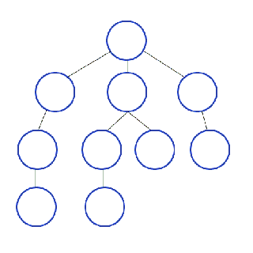

# DFS Depth First Search 
> 깊이 우선 탐색  
트리나 그래프에서 한 루트로 탐색하다가 분기되는 상황에서 최대한 깊숙히 탐색하고 돌아가 다른 루트를 탐색하는 방식

- 자기자신을 호출하는 순환알고리즘형태(재귀호출)을 사용하여 구현하는게 일반적며 stack 배열로 구현하기도 한다.
- 노드를 방문했었는지 검사해야 무한루프(또는 스택오버플로우)에 빠지지 않는다.
- 구현하기편하고 메모리 요구량이 크지않다.  
- 모든 노드를 방문하고자할때 사용한다.
- BFS와 비교할때 단순 검색 속도는 느리지만 공통 상위요소를 가지는 가지를 쳐낼수있기 때문에 트래버스하며 백트랙킹시 시간을 단축할 수 있다. 

